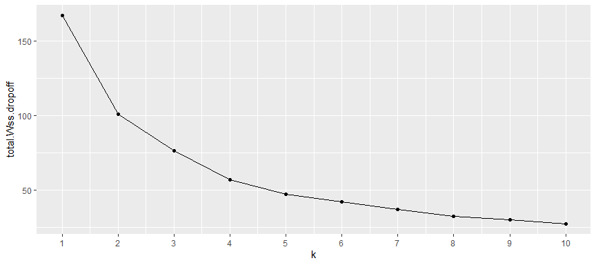

Final Team Project
================
Abizer, Matthew, Ping, Rosy
12/15/2022

    Rows: 195,807
    Columns: 19
    $ ...1                  <dbl> 24238194, 27835199, 44984355, 25894730, 17610152…
    $ key                   <dttm> 2015-05-07 19:52:06, 2009-07-17 20:04:56, 2009-…
    $ fare_amount           <dbl> 7.5, 7.7, 12.9, 5.3, 16.0, 4.9, 24.5, 9.7, 12.5,…
    $ pickup_datetime       <chr> "2015-05-07 19:52:06 UTC", "2009-07-17 20:04:56 …
    $ pickup_longitude      <dbl> -73.99982, -73.99435, -74.00504, -73.97612, -73.…
    $ pickup_latitude       <dbl> 40.73835, 40.72823, 40.74077, 40.79084, 40.74408…
    $ dropoff_longitude     <dbl> -73.99951, -73.99471, -73.96256, -73.96532, -73.…
    $ dropoff_latitude      <dbl> 40.72322, 40.75032, 40.77265, 40.80335, 40.76125…
    $ passenger_count       <dbl> 1, 1, 1, 3, 5, 1, 5, 1, 1, 1, 5, 1, 1, 2, 1, 2, …
    $ pickup_time           <chr> "19:52", "20:04", "21:45", "08:22", "17:47", "02…
    $ pickup_year           <chr> "2015", "2009", "2009", "2009", "2014", "2011", …
    $ pickup_month_dash     <chr> "-05-", "-07-", "-08-", "-06-", "-08-", "-02-", …
    $ pickup_month          <chr> "05", "07", "08", "06", "08", "02", "10", "02", …
    $ pickup_date_dash      <chr> "-05", "-07", "-08", "-06", "-08", "-02", "-10",…
    $ pickup_date           <chr> "05", "07", "08", "06", "08", "02", "10", "02", …
    $ pickup_longitude_mod  <dbl> -73.99982, -73.99435, -74.00504, -73.97612, -73.…
    $ pickup_latitude_mod   <dbl> 40.73835, 40.72823, 40.74077, 40.79084, 40.74408…
    $ dropoff_longitude_mod <dbl> -73.99951, -73.99471, -73.96256, -73.96532, -73.…
    $ dropoff_latitude_mod  <dbl> 40.72322, 40.75032, 40.77265, 40.80335, 40.76125…
          ...1               key                          fare_amount    
     Min.   :       1   Min.   :2009-01-01 01:15:22.00   Min.   :-52.00  
     1st Qu.:13831298   1st Qu.:2010-08-20 21:31:41.50   1st Qu.:  6.00  
     Median :27751460   Median :2012-03-20 21:34:00.00   Median :  8.50  
     Mean   :27712051   Mean   :2012-03-21 12:11:24.11   Mean   : 11.34  
     3rd Qu.:41542689   3rd Qu.:2013-10-19 14:38:38.00   3rd Qu.: 12.50  
     Max.   :55423567   Max.   :2015-06-30 23:40:39.00   Max.   :499.00  
     pickup_datetime    pickup_longitude pickup_latitude dropoff_longitude
     Length:195807      Min.   :-77.32   Min.   :40.33   Min.   :-75.42   
     Class :character   1st Qu.:-73.99   1st Qu.:40.74   1st Qu.:-73.99   
     Mode  :character   Median :-73.98   Median :40.75   Median :-73.98   
                        Mean   :-73.98   Mean   :40.75   Mean   :-73.97   
                        3rd Qu.:-73.97   3rd Qu.:40.77   3rd Qu.:-73.97   
                        Max.   :-71.90   Max.   :42.48   Max.   :-71.72   
     dropoff_latitude passenger_count   pickup_time        pickup_year       
     Min.   :40.33    Min.   :  0.000   Length:195807      Length:195807     
     1st Qu.:40.74    1st Qu.:  1.000   Class :character   Class :character  
     Median :40.75    Median :  1.000   Mode  :character   Mode  :character  
     Mean   :40.75    Mean   :  1.685                                        
     3rd Qu.:40.77    3rd Qu.:  2.000                                        
     Max.   :42.46    Max.   :208.000                                        
     pickup_month_dash  pickup_month       pickup_date_dash   pickup_date       
     Length:195807      Length:195807      Length:195807      Length:195807     
     Class :character   Class :character   Class :character   Class :character  
     Mode  :character   Mode  :character   Mode  :character   Mode  :character  
                                                                                
                                                                                
                                                                                
     pickup_longitude_mod pickup_latitude_mod dropoff_longitude_mod
     Min.   :-77.32       Min.   :40.33       Min.   :-75.42       
     1st Qu.:-73.99       1st Qu.:40.74       1st Qu.:-73.99       
     Median :-73.98       Median :40.75       Median :-73.98       
     Mean   :-73.98       Mean   :40.75       Mean   :-73.97       
     3rd Qu.:-73.97       3rd Qu.:40.77       3rd Qu.:-73.97       
     Max.   :-71.90       Max.   :42.48       Max.   :-71.72       
     dropoff_latitude_mod
     Min.   :40.33       
     1st Qu.:40.74       
     Median :40.75       
     Mean   :40.75       
     3rd Qu.:40.77       
     Max.   :42.46       

    # A tibble: 195,118 × 10
       fare_amount passenger_count pickup_time pickup_year pickup_month pickup_date
             <dbl>           <dbl> <chr>       <chr>       <chr>        <chr>      
     1         7.5               1 19:52       2015        05           05         
     2         7.7               1 20:04       2009        07           07         
     3        12.9               1 21:45       2009        08           08         
     4         5.3               3 08:22       2009        06           06         
     5        16                 5 17:47       2014        08           08         
     6         4.9               1 02:27       2011        02           02         
     7        24.5               5 07:04       2014        10           10         
     8         9.7               1 09:32       2012        02           02         
     9        12.5               1 19:06       2012        03           03         
    10         6.5               1 17:32       2015        05           05         
    # … with 195,108 more rows, and 4 more variables: pickup_latitude_mod <dbl>,
    #   pickup_longitude_mod <dbl>, dropoff_latitude_mod <dbl>,
    #   dropoff_longitude_mod <dbl>

    Rows: 120,129
    Columns: 11
    $ fare_amount           <dbl> 7.5, 7.7, 12.9, 16.0, 24.5, 9.7, 12.5, 10.9, 9.7…
    $ passenger_count       <dbl> 1, 1, 1, 5, 5, 1, 1, 1, 2, 2, 1, 1, 2, 5, 1, 1, …
    $ pickup_time           <chr> "19:52", "20:04", "21:45", "17:47", "07:04", "09…
    $ pickup_year           <chr> "2015", "2009", "2009", "2014", "2014", "2012", …
    $ pickup_month          <chr> "05", "07", "08", "08", "10", "02", "03", "06", …
    $ pickup_date           <chr> "05", "07", "08", "08", "10", "02", "03", "06", …
    $ pickup_longitude_mod  <dbl> -73.99982, -73.99435, -74.00504, -73.92502, -73.…
    $ pickup_latitude_mod   <dbl> 40.73835, 40.72823, 40.74077, 40.74408, 40.69397…
    $ dropoff_longitude_mod <dbl> -73.99951, -73.99471, -73.96256, -73.97308, -73.…
    $ dropoff_latitude_mod  <dbl> 40.72322, 40.75032, 40.77265, 40.76125, 40.77430…
    $ distance              <dbl> 1.045240, 1.526012, 3.127281, 2.778980, 7.284240…

<!-- -->

    # A tibble: 3 × 2
      cluster_assign     n
      <chr>          <int>
    1 1               7135
    2 2              44385
    3 3              68609

    Warning in region == c("new york", "new jersey"): longer object length is not a
    multiple of shorter object length

<!-- -->
