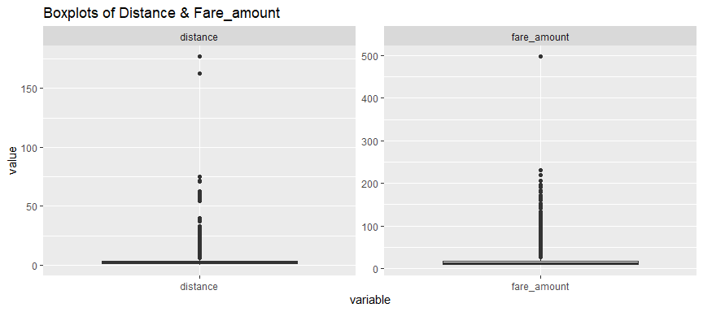
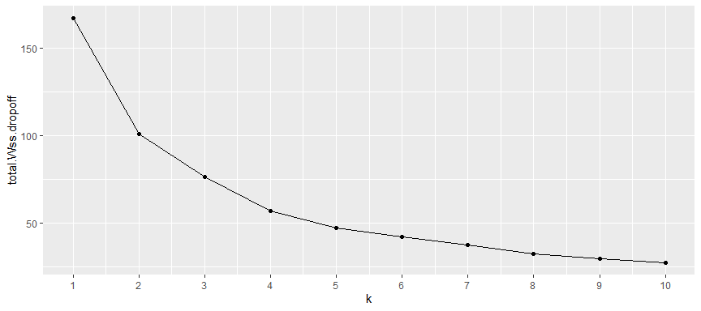
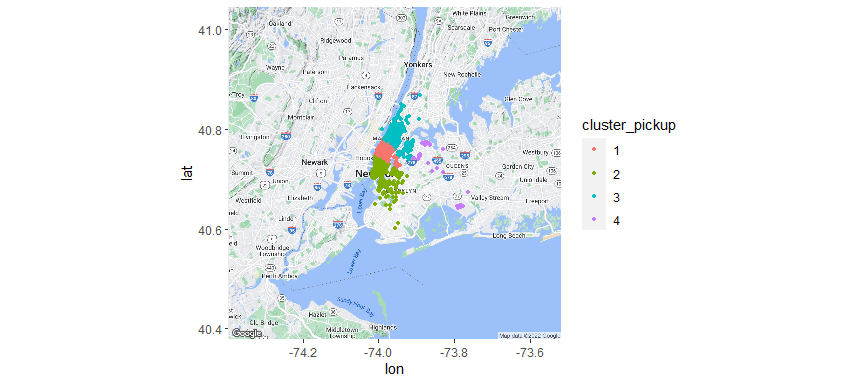
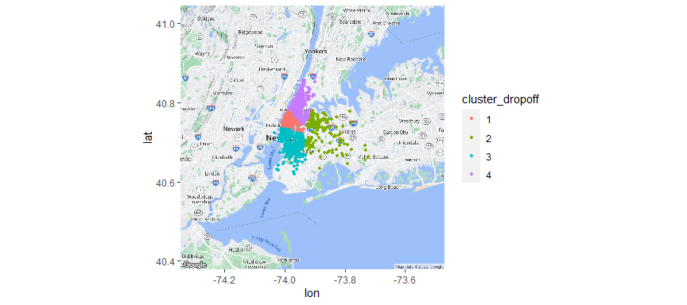
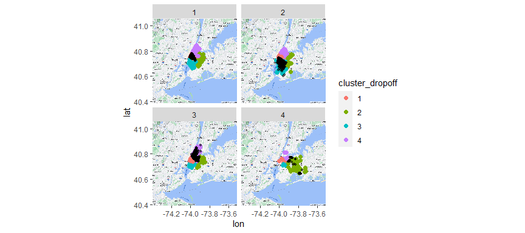
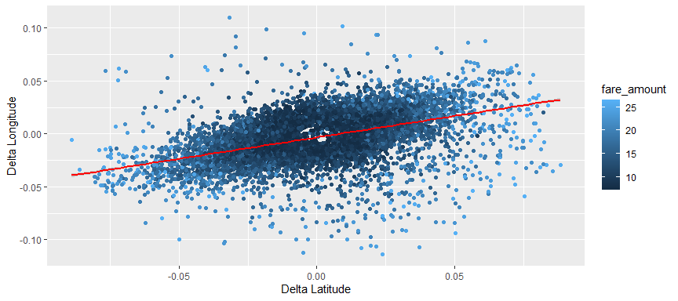
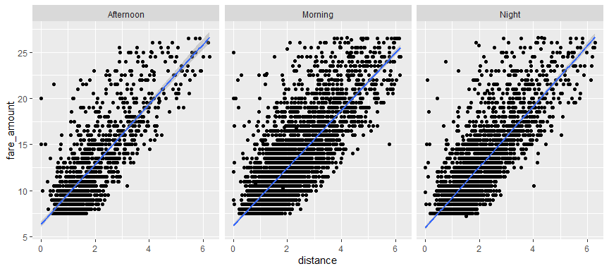
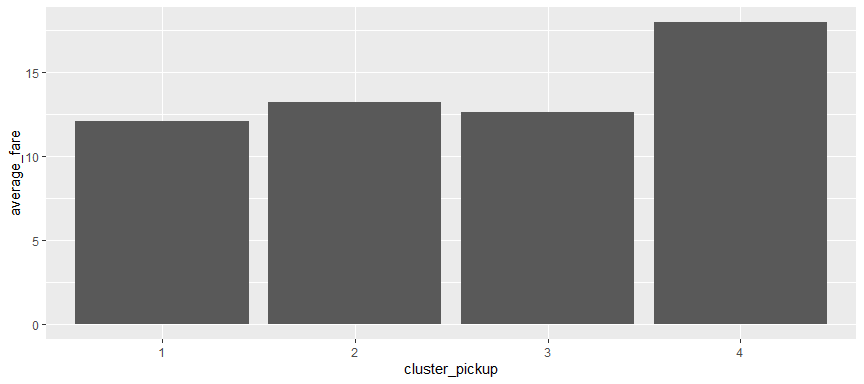

Final Team Project
================
Abizer, Matthew, Ping, Rosy
12/15/2022

    Warning in pickup_time < 12:0: longer object length is not a multiple of shorter
    object length
    Warning in pickup_time > 18:0: longer object length is not a multiple of shorter
    object length

**Project Overview**

Motivation: Uber fare can sometimes be unpredictable. Sometimes, a short
1-mile ride from Upland College Park Apartment to Bauer Center cost
around 70 dollars; other times, a 30-minute ride only cost 15 dollars.
While these prices seem to make no sense at first glance, we believe
there exists underlying explanations for the huge fluctuations in the
Uber fares. In this project, we set our focus in New York City and use a
data set that records information about 200,000 Uber rides in the City
from 2009-2015. By using the tools learned in this class, such as data
wrangling, ggplot, and machine learning models, on this dataset, we
aimed to discover how the fares are determined - with what predictors
and how important are these predictors?

**Objective:** Through this project, we wish to answer the following
questions: 1. What are some of the important variables in determining
uber fare? 2. Are there strategies uber users can use to minimize cost?

Approach: To answer the above questions, we will take the following
steps: 1. Clean the data a. Data wrangling b.Clustering to make
continuous variable into categorical variable 2. Applying model to our
dataset a. Random forest 3. Analyzing the model outcome

**Data**

Data Description:

The dataset is found on Kaggle:
<https://www.kaggle.com/datasets/yasserh/uber-fares-dataset>

The dataset is called Uber Fares Dataset. There are 200,000 samples and
9 columns in the dataset. The columns include: key - a unique identifier
for each trip fare_amount - the cost of each trip in usd
pickup_datetime - date and time when the meter was engaged
passenger_count - the number of passengers in the vehicle (driver
entered value) pickup_longitude - the longitude where the meter was
engaged pickup_latitude - the latitude where the meter was engaged
dropoff_longitude - the longitude where the meter was disengaged
dropoff_latitude - the latitude where the meter was disengaged

Since key is just an identifier variable, we drop it from our
predictors. Our dependent variable is fare_amount, all rest variables
are the predictors. However, we recognize that in their current state,
these predictors would result in too much noise when making predictions
as they are in raw number form that might not make too much sense. Thus,
we will first need to pre-process our predictors.

**Variables Pre-processing**

**Step one:** We begin by doing some simple operations to the below
variable so they are easier for us to use later on for more complicated
processing.

Pickup_datetime: We chose to break down this variable into separate
columns that extracted the pickup time, year, date, and month.

**Step two:** We wish to remove the outliers to reduce noise and also
narrow down our scope of analysis to 2015 data

Location variables: We filtered the latitude and longitude coordinates
to fit those of New York city because most of the coordinates in this
dataset belong within the city. Those few that do not are outliers.
Thus, we want to focus our study in this area only.

Distance and Fare_amount:  
We use the boxplot below to determine the range for outliers in these
two variables.

<!-- -->

Narrow down to 2015 data: As mentioned above, we cleaned our data when
removing outliers. However, the dataset is still too big. Thus, we
filtered by year and focused our analysis on 2015 only. We used year as
the variable for data splitting since we believe the difference in fare
caused by the different years reflects more of the general economy such
as inflation and less of how Uber calculates its fare prices. Thus it is
not a very crucial predictor, so we can ditch it and use it to divide
data.

**Step three:** After we simply the variables, we perform more
complicated changes to them

As of now, our predictors include: passenger count, pickup month, pickup
date, pickup longitude, pickup latitude, dropoff longitude and dropoff
latitude. We now further process them to make them cleaner predictors to
the model. The process includes categorizing continuous variables and
extracting useful information, such as distance, from existing
variables.

**1. Time Category:** As part of our research, we were interested in
learning to predict uber fare prices at different times of the day so we
included a time category column that categorized the pickup times into
morning, afternoon, and night. We used the mutate function to categorize
times between 0:01 and 12:00 as morning, times between 12:01 and 18:00
as afternoon, and times between 18:01 and 24:00 as evening.

**2. Distance (straight-line):** Our original dataset did not include
the distances of each ride, but we recognized that distance is a crucial
variable affecting fare price and created our own distance variable. To
do this, we first wrote a distance conversion function that takes in a
starting coordinate (in the form of latitude and longitude) and ending
coordinate. Then, we perform some trigonometry calculations using the
trig library in r. The function outputs the straight line distance
between the 2 input coordinates. Using this function along with the
mutate function, we create the new column with the pickup longitude and
latitude and drop off longitude and latitude variables. However, note
this function only outputs the straight line distance between 2 points,
which might not exactly correctly reflect the distance traveled by the
uber since roads are often indirect. This might mislead our model at
times. For instance, consider the case where there are two rides: ride
one with the straight line distance of 4 miles, ride two with straight
line distance of 5 miles. However, ride two is mostly on a direct
freeway and the actual distance is 6 miles. Yet ride one is entirely on
city roads so the actual distance is 8 miles. As a result, our distance
will tell us that ride one has a shorter distance but in reality ride
two has the shorter distance. Since we expect distance to directly
correlate with the fare, this might occasionally teach the model the
false fact that a ride with shorter distance has a more expensive
fare.However, even with the imperfection mentioned, we argue it is not
detrimental to our prediction and the variable is still worth keeping
for the following reasons: 1) our straight line distance is still
correlated with the actual distance traveled. Ie. A ride with a shorter
straight line distance between two points is more likely to have a
shorter actual distance. 2) Since we control our ride to all within New
York City, the type of roads the uber travels on are restricted to
similar city roads. Thus, the difference between straight-line distance
and actual distance is controlled. 3) Distance could be one of the most
important variables in predicting fare amount as we expect distance to
correlate directly with fare. Thus, having any distance information
would be helpful to our prediction and explanation of the fare amount.
With these reasons, we decide to keep this variable.

**3. Pickup/Dropoff Clusters:** Looking at the pickup and dropoff
coordinates, we realized that the coordinates themselves would not be
very good predictors to give to a random forest model because it’s an
area measure, which is relative. The random forest model is calculating
how much more predictive the variable will be if the coordinate
increases by 1, which is not very helpful. As a result, we believe it
would be more accurate to group the coordinates in clusters to find a
pattern with the trips. We did not have specific neighborhoods in our
dataset, so we used k-means clustering to break up our data points into
4 clusters. To determine our k value, we plotted a graph of the total
within-cluster variation against different k values. Our graph suggested
that k should be optimally 4 because a higher k value leads to an
insignificant reduction in within-cluster variation.

    Warning: Quick-TRANSfer stage steps exceeded maximum (= 5326550)

    Warning: Quick-TRANSfer stage steps exceeded maximum (= 5326550)
    Warning: `data_frame()` was deprecated in tibble 1.1.0.
    ℹ Please use `tibble()` instead.

<!-- -->

Then, we visualized the k means clustering (based on pickup and dropoff
clusters) on a map of New York City

<!-- --><!-- -->

Through the map above, we can see the distribution of pickup and
drop-off locations in New York in our dataset. Bottom most can be
defined as Downtown and Brooklyn area, ones to the right would be
considered Queens, top most would be defined as the Upper East Side and
West Side stretching up to the Bronx and the sandwiched one would be
defined as Midtown. This is useful because it shows which areas of New
York city our model will be useful for the most. However, the pickup and
dropoff clusters do not tell us anything regarding direction.

The question of whether uber rides are mostly within clusters or between
clusters is still uncertain. Therefore, we created another set of maps
(map 1 for pickup cluster 1, map 2 or pickup cluster 3, etc…).

<!-- -->

For all maps, the black points are the pickup locations and the colored
points are the corresponding dropoff locations. For map where the pickup
points are concentrated in Downtown and Brooklyn area, the dropoff
locations are all over New York state and spread out evenly across the 4
clusters. For map where the pickup points are centered around LaGuardia
Airport and John F. Kennedy Airport, the dropoff points are spread out
across Queens, with a minority of dropoff points in Manhattan
(specifically midtown Manhattan and the Bronx). Additionally, there are
significantly fewer pick-up up locations in Queens, as represented by
the lower density of black dots. For map where most of the pickup points
are in Upper East Side and West Side stretching up to the Bronx the
drop-off points are all over New York. For map where most of the pickup
points are in Midtown the dropoff points are also all over New York.

    # A tibble: 4 × 2
      cluster_pickup     n
      <chr>          <int>
    1 1               3621
    2 2               2504
    3 3               1808
    4 4                 81

The tibble above shows that most of the uber rides in this data set are
within Manhattan, Queens, and Brooklyn

    Warning: package 'units' was built under R version 4.2.2

**4. Direction:** While the pickup and dropoff coordinates allowed us to
compute the distance of the uber ride, we still had no numerical way to
measure direction. The clustering was slightly more helpful in telling
us direction, but its role was more visual than anything. So, we wanted
to determine the relevance of direction for the calculation of fare
amount. So, we created a scatter plot of the delta’s of the longitude
and latitudes of coordinates, and colored them based on the fare amount.
We also added a line of best fit to see if there was any sort of
relationship for direction. As you can see the direction of the trip
does matter. For reference, it is the direction of the trip from 180 to
-180 degrees, and the horizontal axis is 0 degrees.

<!-- -->

Now that we knew distance was significant to some extent, we used the
atan2() function, which takes the sine of the difference between the
dropoff and pickup longitudes and latitudes, and the cosine of the
difference between the dropoff and the pickup latitudes, and returns the
arctangent of that result. This value represents the direction of the
trip in radians. We then use mutate to assign this value to each of the
uber rides in 2015.

**Individual Variable Impact**

<!-- -->

**Time of Day:** We further split the pickup times and categorized them
based on time of day. The reason we did this was because we realized
that there would likely be a higher demand for uber rides when people
left for work in the morning, or when people head home (during rush
hour). However, when we visualized the relationship between fare amount
and distance, depending on time of day, it revealed that time does not
have a lot of influence on fare amount.

<!-- -->

**Cluster impact on fares:** Based on the graph above, fares in Queens
are on average 5 dollars higher. At first glance, it seems that the
obvious advice would be not to call an uber if an individual is in
cluster Queens, however, when we look at a map of Queens, we can see
that the pickup points are mostly at LaGuardia Airport and John F.
Kennedy Airport. Uber fare prices tend to be higher at airports,
according to InsideHook (Your Uber Ride from the Airport May Get More
Expensive. Here’s Why. - InsideHook). There are additional pickup and
dropoff fees associated with specific airports, and supply and demand
factors will also lead to increased fare prices. However, it would still
be wise to take other forms of transportation such as train or bus to
minimize cost.

**Analysis**

    Call:
     randomForest(formula = fare_amount ~ pickup_latitude_mod + pickup_longitude_mod +      dropoff_latitude_mod + dropoff_longitude_mod + pickup_time +      distance + direction + passenger_count + pickup_month + pickup_date,      data = uber_dist_2015, ntree = 250, mtry = 7) 
                   Type of random forest: regression
                         Number of trees: 250
    No. of variables tried at each split: 7

              Mean of squared residuals: 5.671877
                        % Var explained: 72.19
                          IncNodePurity
    pickup_latitude_mod        5384.608
    pickup_longitude_mod       5368.234
    dropoff_latitude_mod       8266.761
    dropoff_longitude_mod      5869.211
    pickup_time               10311.542
    distance                 102409.793
    direction                 19012.116
    passenger_count            1287.813
    pickup_month               1449.186
    pickup_date                1441.254

Model result Determine which predictors to use and training our model

The random forest call above shows the output of our random forest model
trained on the 2015 data set. We used this output to determine which
predictors we should use in our final random forest model. Based on the
increased node purity column, we determined that passenger count, pickup
month, and pickup date were the least important variables, and should be
removed in our final model. Pickup month and pickup date were not that
significant probably because it was too general of a predictor.
Passenger count was also rather insignificant because, according to
uber, they do not charge more for additional passengers, up to 4
passengers. In our data set, passenger counts of over 4 (5 or 6
passengers) only accounted for 9% of the total uber rides. Looking at
the importance of longitude and latitude, it is interesting to see that
latitude had a higher increase in node purity than longitude. Then is
supported by the by that our k means clustering model grouped the
coordinates more horizontally (by latitude) rather than vertically. The
clusters split Manhattan into 3 sections (downtown, midtown, and uptown,
with some of the clustering spread towards Brooklyn and Queens).

    Call:
     randomForest(formula = fare_amount ~ pickup_latitude_mod + pickup_longitude_mod +      dropoff_latitude_mod + dropoff_longitude_mod + pickup_time +      distance + direction, data = uber_dist_2015, ntree = 250,      mtry = 7) 
                   Type of random forest: regression
                         Number of trees: 250
    No. of variables tried at each split: 7

              Mean of squared residuals: 5.755222
                        % Var explained: 71.78

This random forest call uses the new selected predictors (based on
importance)

**Final Conclusion:**

In conclusion, through our analysis of fare price with respect to
distance, pickup and dropoff location and time, we were able to get a
better understanding of the main determinants of how much an Uber ride
costs in New York. By separating the pickup and dropoff locations into
multiple clusters we were able to clean the longitude and latitude data
to fit a more generalized sorting. We were then able to calculate the
distribution of rides from each cluster to their respective
destinations. In our graph, we saw that there was a relatively low
amount of ride traffic from the Queens district compared to Manhattan.
From a fare cost minimizing perspective, we would recommend avoiding
taking uber rides to and from the airport. Other modes of transportation
such as trains or buses would be more cost effective for leaving and
going to the airport. However, when traveling within Manhattan, there
wasn’t a significant cost mitigation strategy. We didn’t find any
noticeable trends of time and direction that consequently increased or
decreased fare price dramatically. In our random forest model, we were
able to obtain a relatively high R2 of 72.24% when predicting fare price
based on pickup longitude, dropoff longitude, pickup time, distance,
direcion, pickup cluster and dropoff cluster. As we hypothesized,
distance was the most important predictor of fare cost. However,
direction and longitude coordinates were also very important forecasters
of fare price. This was largely due to the importance of these variables
in determining which cluster a passenger is traveling to. Because our
clustering was conducted vertically, the longitude coordinates were able
to help us identify which cluster the rider was picked up and dropped
off at. Though we were able to find high correlation between our
explanatory variables and fare prices, a few methods have been taken to
improve our analysis. We could have obtained the actual road paths of
rides to gain a better understanding of which roads were taken and how
that affects fare cost. Additionally, we could have included weather
data to determine if there is any correlation between weather conditions
and fare prices. Furthermore, we could have included supply and demand
data to analyze how many people were trying to call a ride at a certain
time versus how many drivers were available to take them. This could
have provided us with more insight on how surge pricing affects the fare
price of an Uber ride. Overall we felt confident about our analysis and
felt we were able to provide significant insight into what factors
affect Uber Prices in the City through a combination of a random forest
model and visualizations such as mapping.
