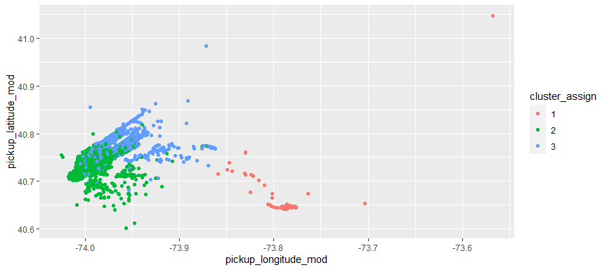
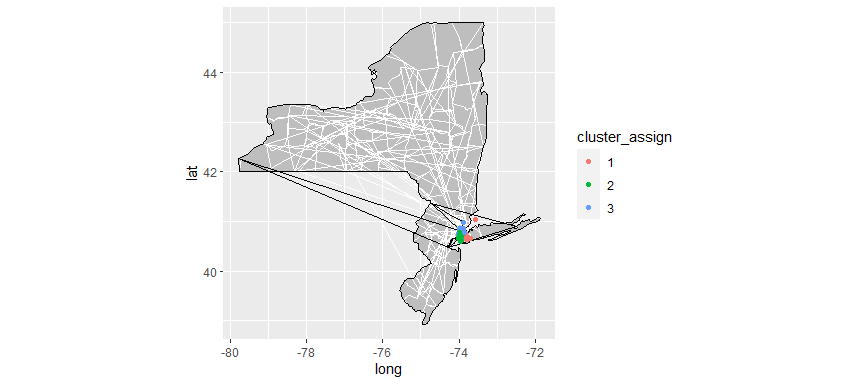
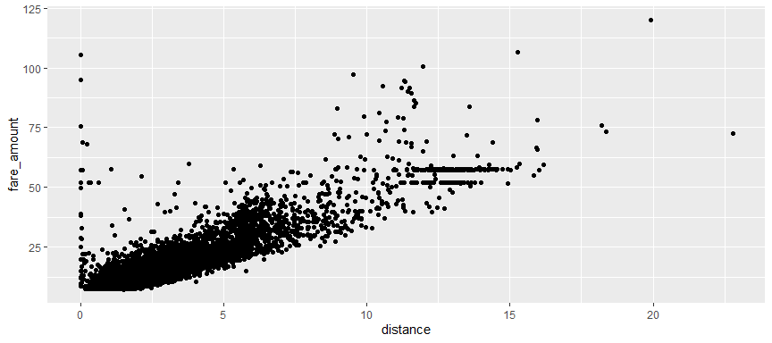
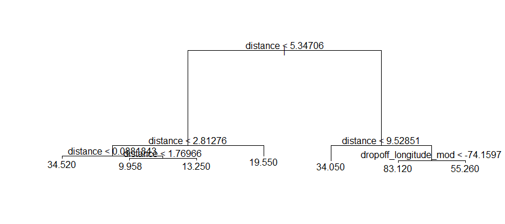
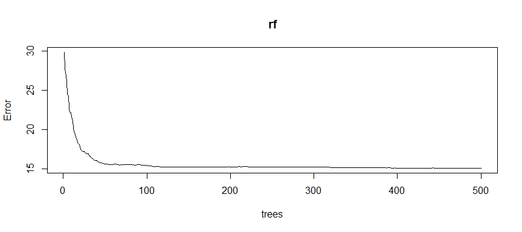

Final Team Project
================
Abizer, Matthew, Ping, Rosy
12/15/2022

    Rows: 195,807
    Columns: 19
    $ ...1                  <dbl> 24238194, 27835199, 44984355, 25894730, 17610152…
    $ key                   <dttm> 2015-05-07 19:52:06, 2009-07-17 20:04:56, 2009-…
    $ fare_amount           <dbl> 7.5, 7.7, 12.9, 5.3, 16.0, 4.9, 24.5, 9.7, 12.5,…
    $ pickup_datetime       <chr> "2015-05-07 19:52:06 UTC", "2009-07-17 20:04:56 …
    $ pickup_longitude      <dbl> -73.99982, -73.99435, -74.00504, -73.97612, -73.…
    $ pickup_latitude       <dbl> 40.73835, 40.72823, 40.74077, 40.79084, 40.74408…
    $ dropoff_longitude     <dbl> -73.99951, -73.99471, -73.96256, -73.96532, -73.…
    $ dropoff_latitude      <dbl> 40.72322, 40.75032, 40.77265, 40.80335, 40.76125…
    $ passenger_count       <dbl> 1, 1, 1, 3, 5, 1, 5, 1, 1, 1, 5, 1, 1, 2, 1, 2, …
    $ pickup_time           <chr> "19:52", "20:04", "21:45", "08:22", "17:47", "02…
    $ pickup_year           <chr> "2015", "2009", "2009", "2009", "2014", "2011", …
    $ pickup_month_dash     <chr> "-05-", "-07-", "-08-", "-06-", "-08-", "-02-", …
    $ pickup_month          <chr> "05", "07", "08", "06", "08", "02", "10", "02", …
    $ pickup_date_dash      <chr> "-05", "-07", "-08", "-06", "-08", "-02", "-10",…
    $ pickup_date           <chr> "05", "07", "08", "06", "08", "02", "10", "02", …
    $ pickup_longitude_mod  <dbl> -73.99982, -73.99435, -74.00504, -73.97612, -73.…
    $ pickup_latitude_mod   <dbl> 40.73835, 40.72823, 40.74077, 40.79084, 40.74408…
    $ dropoff_longitude_mod <dbl> -73.99951, -73.99471, -73.96256, -73.96532, -73.…
    $ dropoff_latitude_mod  <dbl> 40.72322, 40.75032, 40.77265, 40.80335, 40.76125…
          ...1               key                          fare_amount    
     Min.   :       1   Min.   :2009-01-01 01:15:22.00   Min.   :-52.00  
     1st Qu.:13831298   1st Qu.:2010-08-20 21:31:41.50   1st Qu.:  6.00  
     Median :27751460   Median :2012-03-20 21:34:00.00   Median :  8.50  
     Mean   :27712051   Mean   :2012-03-21 12:11:24.11   Mean   : 11.34  
     3rd Qu.:41542689   3rd Qu.:2013-10-19 14:38:38.00   3rd Qu.: 12.50  
     Max.   :55423567   Max.   :2015-06-30 23:40:39.00   Max.   :499.00  
     pickup_datetime    pickup_longitude pickup_latitude dropoff_longitude
     Length:195807      Min.   :-77.32   Min.   :40.33   Min.   :-75.42   
     Class :character   1st Qu.:-73.99   1st Qu.:40.74   1st Qu.:-73.99   
     Mode  :character   Median :-73.98   Median :40.75   Median :-73.98   
                        Mean   :-73.98   Mean   :40.75   Mean   :-73.97   
                        3rd Qu.:-73.97   3rd Qu.:40.77   3rd Qu.:-73.97   
                        Max.   :-71.90   Max.   :42.48   Max.   :-71.72   
     dropoff_latitude passenger_count   pickup_time        pickup_year       
     Min.   :40.33    Min.   :  0.000   Length:195807      Length:195807     
     1st Qu.:40.74    1st Qu.:  1.000   Class :character   Class :character  
     Median :40.75    Median :  1.000   Mode  :character   Mode  :character  
     Mean   :40.75    Mean   :  1.685                                        
     3rd Qu.:40.77    3rd Qu.:  2.000                                        
     Max.   :42.46    Max.   :208.000                                        
     pickup_month_dash  pickup_month       pickup_date_dash   pickup_date       
     Length:195807      Length:195807      Length:195807      Length:195807     
     Class :character   Class :character   Class :character   Class :character  
     Mode  :character   Mode  :character   Mode  :character   Mode  :character  
                                                                                
                                                                                
                                                                                
     pickup_longitude_mod pickup_latitude_mod dropoff_longitude_mod
     Min.   :-77.32       Min.   :40.33       Min.   :-75.42       
     1st Qu.:-73.99       1st Qu.:40.74       1st Qu.:-73.99       
     Median :-73.98       Median :40.75       Median :-73.98       
     Mean   :-73.98       Mean   :40.75       Mean   :-73.97       
     3rd Qu.:-73.97       3rd Qu.:40.77       3rd Qu.:-73.97       
     Max.   :-71.90       Max.   :42.48       Max.   :-71.72       
     dropoff_latitude_mod
     Min.   :40.33       
     1st Qu.:40.74       
     Median :40.75       
     Mean   :40.75       
     3rd Qu.:40.77       
     Max.   :42.46       

    # A tibble: 13,528 × 10
       fare_amount passeng…¹ picku…² picku…³ picku…⁴ picku…⁵ picku…⁶ picku…⁷ dropo…⁸
             <dbl>     <dbl> <chr>   <chr>   <chr>   <chr>     <dbl>   <dbl>   <dbl>
     1         7.5         1 19:52   2015    05      05         40.7   -74.0    40.7
     2         6.5         1 17:32   2015    05      05         40.7   -74.0    40.7
     3        12           1 08:58   2015    03      03         40.8   -74.0    40.8
     4         5           2 23:15   2015    03      03         40.7   -74.0    40.7
     5        12           1 09:17   2015    01      01         40.7   -74.0    40.8
     6         9           1 17:52   2015    06      06         40.7   -74.0    40.7
     7         8.5         2 11:19   2015    02      02         40.7   -74.0    40.8
     8        21           1 14:56   2015    05      05         40.8   -74.0    40.8
     9        11           1 13:31   2015    05      05         40.8   -74.0    40.8
    10         3.5         2 01:35   2015    05      05         40.8   -74.0    40.7
    # … with 13,518 more rows, 1 more variable: dropoff_longitude_mod <dbl>, and
    #   abbreviated variable names ¹​passenger_count, ²​pickup_time, ³​pickup_year,
    #   ⁴​pickup_month, ⁵​pickup_date, ⁶​pickup_latitude_mod, ⁷​pickup_longitude_mod,
    #   ⁸​dropoff_latitude_mod

    Rows: 9,166
    Columns: 11
    $ fare_amount           <dbl> 7.50, 12.00, 12.00, 9.00, 8.50, 21.00, 11.00, 9.…
    $ passenger_count       <dbl> 1, 1, 1, 1, 2, 1, 1, 1, 2, 1, 4, 2, 1, 6, 2, 1, …
    $ pickup_time           <chr> "19:52", "08:58", "09:17", "17:52", "11:19", "14…
    $ pickup_year           <chr> "2015", "2015", "2015", "2015", "2015", "2015", …
    $ pickup_month          <chr> "05", "03", "01", "06", "02", "05", "05", "04", …
    $ pickup_date           <chr> "05", "03", "01", "06", "02", "05", "05", "04", …
    $ pickup_longitude_mod  <dbl> -73.99982, -73.96253, -73.97952, -73.97214, -73.…
    $ pickup_latitude_mod   <dbl> 40.73835, 40.76719, 40.72731, 40.74989, 40.73622…
    $ dropoff_longitude_mod <dbl> -73.99951, -73.97446, -73.98488, -73.98186, -73.…
    $ dropoff_latitude_mod  <dbl> 40.72322, 40.75386, 40.76065, 40.73243, 40.76135…
    $ distance              <dbl> 1.045240, 1.111678, 2.318986, 1.308611, 1.922588…

<!-- -->

    # A tibble: 3 × 2
      cluster_assign     n
      <chr>          <int>
    1 1                296
    2 2               5307
    3 3               3563

    Warning in region == c("new york", "new jersey"): longer object length is not a
    multiple of shorter object length

<!-- -->

uber_dist_mod2 \<- uber_dist %\>% filter(cluster_assign == “2”) %\>%
select(dropoff_latitude_mod, dropoff_longitude_mod)

    #Cluster 2 Pickup= Mostly JFK airport and Queens
    #Cluster 2 Dropoff = Literally everywhere in New York (Manhattan, Bronx, Long Island, Brooklyn) Not so much concentration at airports though

    library(leaflet)
    uber_dist_mod2 <- sample_frac(uber_dist_mod2, 1)

    map <- leaflet(data=uber_dist_mod2) %>% addTiles() %>% addMarkers(~dropoff_longitude_mod, ~dropoff_latitude_mod)

    map

\#Cluster 1 pickup = Mostly Manhattan, some Bronx, some Brooklyn, and
some LaGuardia (none JFK) \#Cluster 1 dropoff = Every in New York with
focus on JFK and LaGuardia and Manhattan uber_dist_mod1 \<- uber_dist
%\>% filter(cluster_assign == “1”) %\>% select(pickup_latitude_mod,
pickup_longitude_mod)

uber_dist_mod1 \<- sample_frac(uber_dist_mod1, 0.5)

map \<- leaflet(data=uber_dist_mod1) %\>% addTiles() %\>%
addMarkers(\~pickup_longitude_mod, \~pickup_latitude_mod)

map

    #cluster 3 Pickup= Manhttan, some Queens, some LaGuardia Airport 
    #Cluster 3 Dropoff = Mostly Manhattan, Queens, and EWR airport                                                                                                                                                                                   

    uber_dist_mod3 <- uber_dist %>% filter(cluster_assign == "3") %>% select(pickup_latitude_mod, pickup_longitude_mod)

    uber_dist_mod3 <- sample_frac(uber_dist_mod3, 0.3)

    map <- leaflet(data=uber_dist_mod3) %>% addTiles() %>% addMarkers(~pickup_longitude_mod, ~pickup_latitude_mod)

    map

<!-- -->

    Warning in tree(fare_amount ~ pickup_latitude_mod + pickup_longitude_mod + : NAs
    introduced by coercion

<!-- -->

    Regression tree:
    tree(formula = fare_amount ~ pickup_latitude_mod + pickup_longitude_mod + 
        dropoff_latitude_mod + dropoff_longitude_mod + distance + 
        passenger_count + pickup_month + pickup_date + pickup_time, 
        data = uber_dist_clean)
    Variables actually used in tree construction:
    [1] "distance"              "dropoff_longitude_mod"
    Number of terminal nodes:  7 
    Residual mean deviance:  22.76 = 208400 / 9156 
    Distribution of residuals:
        Min.  1st Qu.   Median     Mean  3rd Qu.     Max. 
    -31.1200  -2.2500  -0.7496   0.0000   1.7500  70.7700 

<!-- -->

                            %IncMSE IncNodePurity
    pickup_latitude_mod   22.655536    131278.942
    pickup_longitude_mod  26.441583    184898.552
    dropoff_latitude_mod  22.245867     87004.178
    dropoff_longitude_mod 35.191917    171540.279
    distance              66.901126    668801.347
    passenger_count       -1.906674      3599.156
    pickup_month           2.042090      5067.801
    pickup_date            4.828704      5048.414
    pickup_time           28.543642     23969.035

    Call:
     randomForest(formula = fare_amount ~ pickup_latitude_mod + pickup_longitude_mod +      dropoff_latitude_mod + dropoff_longitude_mod + distance +      passenger_count + pickup_month + pickup_date + pickup_time,      data = uber_dist_clean, keep.forest = FALSE, importance = TRUE) 
                   Type of random forest: regression
                         Number of trees: 500
    No. of variables tried at each split: 3

              Mean of squared residuals: 15.1325
                        % Var explained: 89.31
